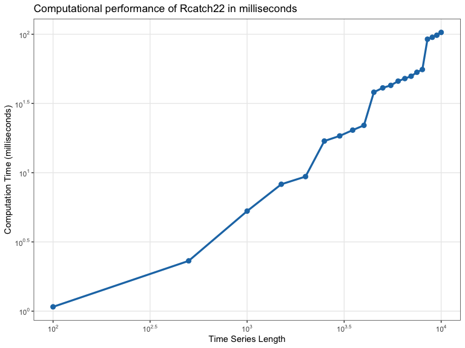

# Rcatch22 

[](http://www.r-pkg.org/pkg/Rcatch22)
[](http://www.r-pkg.org/pkg/Rcatch22)
[](https://zenodo.org/badge/latestdoi/353530083)

R package for the calculation of [22 CAnonical Time-series
CHaracteristics](https://github.com/chlubba/catch22). The package is an
efficient implementation that calculates time-series features coded in
C.

## Installation

*Coming to CRAN soon… Stay posted\!*

You can install the development version of `Rcatch22` from GitHub using
the following:

``` r
devtools::install_github("hendersontrent/Rcatch22")
```

## Wiki

Please open the included vignette within an R environment or visit the
detailed [`Rcatch22`
Wiki](https://github.com/hendersontrent/Rcatch22/wiki) for information
and tutorials.

## Computational performance

With features coded in C, `Rcatch22` is highly computationally
efficient. Computation time in *milliseconds* for a range of time series
lengths is presented below.

<!-- -->

## Citation

A DOI is provided at the top of this README. Alternatively, the package
can be cited using the following:

``` 

To cite package 'Rcatch22' in publications use:

  Trent Henderson (2021). Rcatch22: Calculation of 22 CAnonical
  Time-series CHaracteristics. R package version 0.1.7.

A BibTeX entry for LaTeX users is

  @Manual{,
    title = {Rcatch22: Calculation of 22 CAnonical Time-series CHaracteristics},
    author = {Trent Henderson},
    year = {2021},
    note = {R package version 0.1.7},
  }
```

Please also cite the original *catch22* paper by using:

  - [Lubba et al. (2019). catch22: CAnonical Time-series
    CHaracteristics.](https://link.springer.com/article/10.1007/s10618-019-00647-x)
